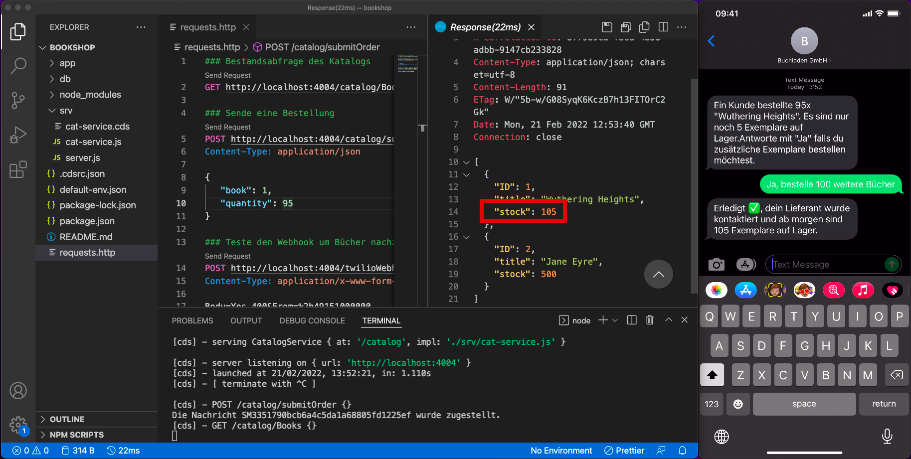

# Twilio Bookshop Management

> This sample project demonstrates how to combine the [Twilio Messaging API](https://www.twilio.com/messaging) with an application built with the [SAP Cloud Application Programming Model](https://cap.cloud.sap/docs/). Basic information about this project can be found in this repository. For more details, please refer to the [following blog post](https://www.twilio.com/blog/how-to-send-and-receive-sms-with-sap-cap-using-twilio).

[](https://www.twilio.com/blog/how-to-send-and-receive-sms-with-sap-cap-using-twilio)


The project builds on the well-established bookshop scenario and improves the user experience of the bookshop owner. Every time the stock of a particular book goes below a pre-defined threshold, a warning is sent to to a shop manager. If the manager then want to restock this item, they can simply reply to the text message to trigger that action. The Twilio platform will then invoke a webhook provided by this application to order more books.


## Prerequisites
- Sign up for a free [Twilio account](https://www.twilio.com/referral/iSDwWn) here - no credit card required
- A [Twilio phone number](https://www.youtube.com/watch?v=f9jE5ywz8cs) from your country that can send SMS messages (the initial credits you get for free are sufficient to buy a number)
- [Node.js LTS version 16](https://nodejs.org/en/download)  installed
- [git](https://nodejs.org/en/download) installed
- [ngrok](https://ngrok.com/download) installed
- [CDS CLI](https://www.npmjs.com/package/@sap/cds-dk) installed
- [SQLite](https://cap.cloud.sap/docs/advanced/troubleshooting#how-do-i-install-sqlite-on-windows) installed (Unix users probably already have it)

Optional: 
[Visual Studio Code](https://code.visualstudio.com/Download) with the following extensions installed:
- The [language support extension](https://marketplace.visualstudio.com/items?itemName=SAPSE.vscode-cds)
- The [REST client extension](https://marketplace.visualstudio.com/items?itemName=humao.rest-client)


>  If you are running macOS or Linux, you will likely have SQLite installed. For Windows users, I recommend using the [Chocolatey](https://chocolatey.org/) package manager to install [sqlite](https://community.chocolatey.org/packages/SQLite) via `choco install sqlite`. After the installation, please check you can start the executable (`sqlite`) from the terminal.

## Getting started
1. Clone this repository and navigate into it
    ```sh
    git clone https://github.com/IObert/twilio-bookshop-management.git
    cd twilio-bookshop-management
    ```

1. To connect this project to your Twilio account, you need to include the [account SID and the secret authentication token](https://www.twilio.com/docs/iam/credentials/api#authentication). It's crucial to keep them private and exclude them from the codebase you check into a git repository. So it makes sense to keep them in the environment variable of the project. In any CAP project, the `default-env.json` file is the perfect place for these secrets as it's already on the `.gitignore` list, and all properties are automatically loaded in the environment variables during startup. For this application, include the sender and receiver number of the text messages to the new file `default-env.json` as well:
    ```json
    {
        "TWILIO_ACCOUNT_SID": "ACXXXXXXX",
        "TWILIO_AUTH_TOKEN": "1acYYYYY",
        "TWILIO_SENDER": "+18600000000",
        "TWILIO_RECEIVER": "+18600000000"
    }
    ```
1. Install all dependencies and start the server
    ```sh
    npm install
    npm start
    ```
1. Start `ngrok`
    ```sh
    ngrok http 4004
    ```
    
    > Alternatily, you can also deploy the app to the cloud and use the URL of the deployed app
1. Go to the [Twilio Console](https://console.twilio.com/?frameUrl=/console) and navigate to your phone number. Add the HTTPS URL that the previous step printed with the `/twilioWebhook` suffix to the section “A message comes in”.
    
1. Trigger a request to order 95 books which results in a warning message to your phone number
    
    
1. Let's give it a shot. Respond with "Yes, please order 100 additional books" to the message you received a few minutes ago. Now query the current stock info via the first HTTP request once more.
    

## Known Issues
If this weren't just a demo but a production app, it would make sense to add proper state management to the application to save which book needs to be reordered instead of extracting this information from the initial text message.

## Get Support

Check out the relevant documentation at [twilio.com/docs/sms](https://www.twilio.com/docs/sms) and [cap.cloud.sap](https://cap.cloud.sap). <br>
If you have a question, find a bug, or otherwise need support, please open an issue in this repository.

## License

This project is licensed under the Apache Software License, version 2.0, except as noted otherwise in the [LICENSE](LICENSE) file.
